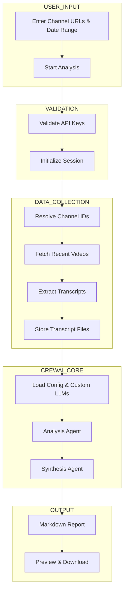

---

# 🎥 CrewAI Multi-Agent YouTube Trend Analyzer (OpenRouter)

A **CrewAI-powered, multi-agent system** that automates YouTube trend and market intelligence using a **vendor-agnostic LLM architecture**.
This project leverages **OpenRouter** to dynamically switch between powerful LLMs (GPT-4o, Claude, Gemini, Llama, etc.) at **low or zero cost**, without hard-coding any provider.

---

## 🚀 Why This Project?

Creators and researchers often spend hours watching videos just to identify patterns.
This tool solves that by deploying a **team of AI agents** that:

* Fetch YouTube video transcripts
* Analyze recurring themes
* Synthesize insights into clean **Markdown reports**
* Eliminate vendor lock-in and expensive API credits

You control the system’s **“brain”** with a single config change.

---

## 🧠 Key Features

* 🤖 CrewAI multi-agent orchestration
* 🔌 Vendor-agnostic LLM routing via OpenRouter
* 💸 Free & low-cost model support
* 🔁 Swap models without refactoring
* 📄 Auto-generated Markdown reports
* 🧩 Modular and extensible design

---

## 🛠️ Tech Stack

* **Python 3.10+**
* **CrewAI**
* **OpenRouter API**
* **YouTube Data API v3**
* **Mermaid (architecture diagrams)**

---

## ⚙️ How OpenRouter Works Here

Instead of binding agents directly to OpenAI, this project initializes a **custom LLM object** inside CrewAI.
All requests are routed through **OpenRouter**, giving access to hundreds of models using a single API key.

Switch models by changing **one line**.

---

## 🧩 Example: Custom LLM Injection

```python
from crewai import LLM, Agent

my_llm = LLM(
    model="openrouter/google/gemini-2.0-flash:free",
    base_url="https://openrouter.ai/api/v1",
    api_key="YOUR_OPENROUTER_API_KEY"
)

researcher = Agent(
    role="Trend Scout",
    goal="Identify recurring themes across video transcripts",
    backstory="You summarize and detect patterns in YouTube content.",
    llm=my_llm
)
```

---

## 🏗️ System Architecture



---

## 🧪 Installation

### 1️⃣ Clone the Repository

```bash
git clone https://github.com/your-username/CrewAI-MultiAgent-YouTube-Trend-Analyzer-OpenRouter.git
cd CrewAI-MultiAgent-YouTube-Trend-Analyzer-OpenRouter
```

---

### 2️⃣ Create & Activate Virtual Environment

**Windows**

```bash
python -m venv venv
venv\Scripts\activate
```

**macOS / Linux**

```bash
python3 -m venv venv
source venv/bin/activate
```

---

### 3️⃣ Install Dependencies

```bash
pip install -r requirements.txt
```

---

## 🔐 Environment Setup

Create a `.env` file in the project root:

```env
OPENROUTER_API_KEY=your_openrouter_api_key
YOUTUBE_API_KEY=your_youtube_data_api_key
```

> ⚠️ **Never commit `.env` files** — ensure it is listed in `.gitignore`.

---

## ▶️ Running the Project

```bash
python main.py
```

OR (if using Streamlit UI)

```bash
streamlit run app.py
```

The system will:

1. Fetch videos from the specified channels
2. Extract transcripts
3. Run CrewAI agents for analysis & synthesis
4. Generate a Markdown report with key trends

---

## 🧪 Use Cases

* YouTube niche research
* Creator content planning
* Market & trend analysis
* Academic or media research
* AI agent experimentation

---

## 🔮 Future Enhancements

* Streamlit / Web dashboard
* Vector search for transcripts
* Automatic niche clustering
* Multi-language support
* Scheduled trend monitoring

---

## 📌 Why This Matters

This project demonstrates:

* Real **multi-agent AI architecture**
* Cost-aware LLM engineering
* Vendor-agnostic design


---

PRs and ideas are welcome.

---


* Optimize this README for **GitHub SEO & recruiters**

Just say it.
